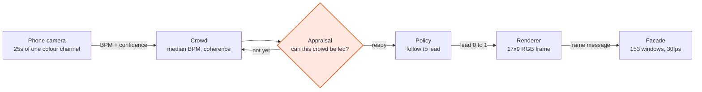
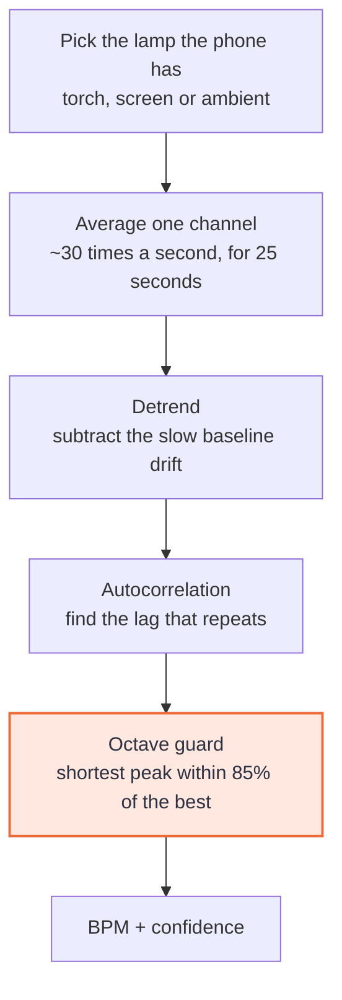
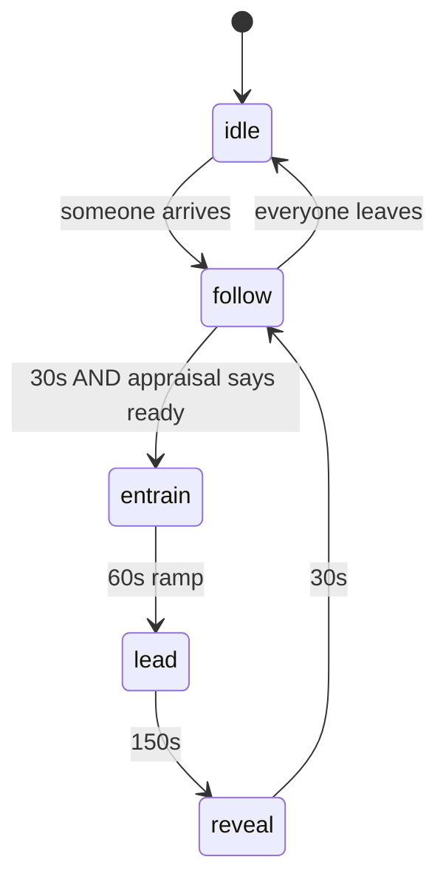

# SYNC

**The MIT Green Building takes the crowd's pulse and gives it back slower.**

Built for [Sundai Hack 140 — *Beyond Tetris: Building-Scale Physical AI*](https://www.sundai.club/events/boston/beyond-tetris-building-scale-physical-ai-for-mit-green-building), 13 September 2026. Targets the live install on the Green Building facade, 29 September.

**▶ [Interactive explainer](https://claude.ai/code/artifact/ed222205-822d-4935-bfde-965e4d9a4618)** — drag one slider and watch the building stop copying you and start leading you. It runs the real render maths in your browser.

---

## ELI5 — thirty seconds

1. **Your finger is a sensor.** One fingertip over a lens, lit by whatever lamp the phone actually has — the rear flash on most Android phones, the screen itself on every iPhone. Every heartbeat pushes blood through your finger and slightly dims the light reaching the camera. Count the dips and you have a heart rate. No hardware, no wearable.
2. **The tower wears it.** 153 windows, 9 across and 17 up. The beat starts at the middle floors and travels outward toward the roof and the street, the way a pulse moves through a body.
3. **Then it takes over.** The building slows its breathing to about six breaths a minute and stops following you. Breathe with a slow rhythm and your heart rate drops. Two minutes later everyone measures again and we put the difference on the screen.

That last step is the point: **a building that measurably slows down the people watching it.**

---

## S — Situation

MIT's Green Building Tetris installation is back: 153 individually lit windows across a 21-storey tower, running at 30 FPS. Sundai Hack 140 takes that hardware off the shelf and asks a different question — *what does it look like to make this building a body?*

The display contract is small and completely open:

```python
Frame.DISPLAY_ROWS = 17
Frame.DISPLAY_COLS = 9        # 17 x 9 = 153, one cell per lit window
display.send(frame)           # at most 30 times a second
```

Anything that can produce a 17×9 grid of RGB at 30 FPS can drive the facade. The renderer is not the hard part. **Almost every team will build a beautiful light pattern; very few will build something with an interior life.** That gap is the opportunity.

## T — Task

Build something in one day that:

- **is genuinely embodied**, not an animation that happens to be on a building
- **is legible at 500 metres**, at night, from across the Charles
- **needs no hardware**, because a crowd cannot be issued sensors
- **makes a falsifiable claim**, so the demo has a receipt rather than a vibe
- **survives to 29 September** in front of a crowd and a camera

The falsifiable claim we picked: paced breathing at roughly 0.1 Hz — about six breaths a minute — sits in the resonance band where slow breathing reliably raises heart-rate variability and lowers sympathetic arousal. Seventeen floors is an extraordinary breathing pacer. So: **measure the crowd, pace the crowd, measure again, show the delta.**

## A — Action

### The whole pipeline



### Step 1 — a finger becomes a number



**Three ways to light a fingertip, and the phone picks.** `web/ppg.js` feature-detects the torch rather than sniffing the user agent, and the phone page names the lens to cover *before* the countdown starts — because the lens is different in each mode.

| Mode | Lamp and lens | Channel | Why |
|---|---|---|---|
| **torch** | rear camera, flash on, one fingertip over both | **red** | Best signal by a distance. Red is the wavelength that makes it through a fingertip at all. |
| **screen** | front camera, page driven white, wake lock held | **green** | **iOS Safari implements no torch constraint**, so this is the path on every iPhone. Screen light is white and weak; haemoglobin absorbs green hard and the sensor is most sensitive there. |
| **ambient** | rear camera, no flash, whatever light is in the room | green | Last resort. The page flags it as the weak one. |

The screen path is not a nicety. Without it every iPhone falls through to `ambient` — covering a rear lens at night, waiting for a flash that iOS will never fire — which at a night demo is close to unusable. A wake lock holds the brightness, because a phone that auto-dims halfway through a 25-second capture destroys the signal without saying so.

Autocorrelation rather than an FFT: at 25 seconds of noisy, motion-corrupted signal it degrades gracefully instead of smearing across bins.

**The octave guard is highlighted because it is the bug that nearly shipped.** For a clean periodic signal the correlation at *twice* the true period is just as high as at the period itself, so a plain `argmax` reports half the real heart rate roughly as often as not. Our first version returned **44 BPM for an 88 BPM pulse**. On stage that is not a crash — it is a plausible-looking number that is quietly wrong by a factor of two, and every downstream number inherits it.

### Step 2 — many phones become one body

`sync/crowd.py`. One vote per person, most recent reading wins, so hammering the button does not make you a crowd. Median rather than mean, so one outlier cannot drag the tower. Readings expire after 120 seconds.

It produces three numbers the rest of the system runs on: **median BPM**, **coherence** (how tightly the crowd's rates cluster) and **presence**.

### Step 3 — the building decides whether it is allowed to lead



**Where the model is actually load-bearing**, and it is worth being precise because it is the first thing worth asking. The control loop is *not* AI — pacing a breath at six per minute is a sine wave and we will not dress it up as anything else.

What Claude does (`sync/appraisal.py`), which nothing else here can:

| | |
|---|---|
| **Appraisal** | Decides whether this crowd *can* be led at all. A scattered, half-arrived crowd paced at six breaths a minute simply ignores you, and a building pushing a rhythm nobody follows looks broken. `lead_ready` is a hard veto on the `follow → entrain` transition above. |
| **Expression** | Chooses how the facade should *feel* — a palette bias folded into the renderer's calm axis. Not what to draw; how to be. |
| **Voice** | One line, first person, from the building. Shown beside the facade and on every phone. |

It runs off the render path on a 20-second cadence. **With no credentials, no network, or a failed call it drops to a deterministic rule-based appraisal and keeps going.** A demo that dies because an API call timed out is a demo that dies on stage.

### Step 4 — two layers of light

| Layer | What it is | What it means |
|---|---|---|
| **Heart** | A lub-dub originating at the chest floors and propagating out toward head and feet, damped as it travels. Driven by the crowd's real measured BPM. | The building is *wearing* a body. |
| **Breath** | A lung. Light fills from the base to the crown on the inhale and empties on the exhale. 40/60 inhale/exhale split — the long exhale is the half that does the calming. | The building is *leading* a body. |

As `lead` runs 0 → 1 the weights cross over. **That crossover is the piece:**

| | `lead = 0` · following | `lead = 1` · leading |
|---|---|---|
| Heart weight | **1.10** | 0.35 |
| Breath weight | 0.26 | **0.95** |
| Breath rate | the crowd's own, ~BPM/4.5 | **6.0 / min** |
| What you see | a crimson beat spiking from the chest | a cyan lung filling seventeen floors |
| Measured beat contrast | **5.97×** | 1.46× |

### Step 5 — onto the facade

SYNC speaks every delivery shape the repo documents, picked by URL scheme:

| `--display` | What it drives |
|---|---|
| **`gbsim://curious-cat`** | **The Green Building simulator — the only path confirmed against a running server.** One POST per frame to `http://sundai.willsarg.com/api/i/<instance>/frame`, body the bare `[[[r,g,b] ×9] ×17]` array, `204` back. |
| `gbsim+https://HOST/INSTANCE` | the same simulator, hosted somewhere else |
| `ws://HOST:9000/tetris-17x9` | remote protocol v1 over WebSocket |
| `tcp://HOST:9000` | remote protocol v1, newline-delimited |
| `py://MODULE:ATTR?args=a,b` | a legacy `Display` subclass. The `args=` are its constructor arguments — `gbsim.WebDisplay(instance, api_url)` takes two, and calling `obj()` on it is an immediate `TypeError`. |
| `none` | preview only (default) |

An `http://` or `https://` URL is accepted as a gbsim endpoint too, with or without the trailing `/frame`, because that is what copying it out of the simulator's address bar gives you. Frames carry the SPEC §9.4 `digest` even though a producer may omit it — a mismatch is the fastest possible way to learn our row order is upside down.

**Do not drive it at 30 FPS.** Measured against the live simulator with a real instance, the viewer's arrival rate saturates near 15 and gets *worse* above it:

| Sent | Arrived | Ratio |
|---|---|---|
| 10 fps | 9.1 | 0.91 |
| 20 fps | 15.2 | 0.76 |
| 28 fps | **13.4** | 0.48 |

That is congestion collapse: pushing harder delivers less. 30 FPS is the display contract's ceiling, not a target, and a facade driven at 30 looks visibly worse than the same facade driven at 15. `HttpProducer` already drops rather than queues — a late frame is worse than a missing one when the next is 33 ms behind it — and its `max_fps` is where that ceiling is set.

## R — Result

**A working web app that shows a heartbeat on 153 windows.**

```
python -m sync
  phones    http://<lan-ip>:8080/
  facade    http://<lan-ip>:8080/preview
```

- **`/` — the phone page.** Hold a finger on the camera for 25 seconds, watch your live pulse waveform draw itself, get your BPM with a signal-quality score, send it to the building. Once the facade starts leading, the phone shows a breathing pacer synced to the same 40/60 curve the tower is running, so the thing in your hand and the thing in front of you are the same breath. Then your personal before/after delta.
- **`/preview` — the facade.** The 17×9 grid rendered with the bloom it has in real life, the phase the building is in, what it is "feeling", crowd BPM, coherence, and the crowd-wide delta. This is the projector screen.

**Verified, not asserted:**

| | |
|---|---|
| Tests | **244 passing** — `python -m pytest -q` |
| Phone estimator vs tested Python reference | agrees to **0.000 BPM** on every fixture, clean and noisy |
| Server | all routes 200, pulse intake live, out-of-range input rejected with 400 |
| First frame | validated against the wire contract before anything is sent |

---

## Why the facade is a torso, not a screen

The single decision everything else follows from.

**Q: It's 153 pixels. What can you actually put on it?**
Not text. Not faces. Not video. At 9 across and 17 up, seen from 500 metres at night, all of that dies. What survives the distance is **colour, vertical motion, and rhythm**.

**Q: So what is that good for?**
That is exactly the vocabulary a body has. So the grid is addressed as an **anatomy** rather than a display (`sync/geometry.py`): head at the crown, heart at row 8 — floor 12 — feet at the base. Nine wide and seventeen tall is not a small screen. It is a torso.

**Q: What did that change in practice?**
Two defects that no test could see, both found only by rendering frames and looking at them:

- Every column in a row was identical, so 153 windows read as **seventeen horizontal stripes** — a barcode, not a body — throwing away eight ninths of the horizontal resolution. The heart layer now runs strongest up the centre line and falls off toward the outer bays.
- The breath palette interpolated hot orange straight to cyan in RGB. Those are near-complementary, so the channels cancel and the midpoint **desaturated to concrete grey** — losing all colour at exactly the moment the building is meant to be visibly transitioning. A violet stop fixed it.

---

## Honest limits

- **Heart rate from a phone camera is reliable. HRV is not.** `rmssd_ms` is computed and carried as a *coarse* calm proxy. It is never shown to anyone as a clinical number, and the phone UI says so in as many words.
- The row→floor and column→bay mapping is **provisional** in the upstream SPEC (§10.4) until confirmed on the building. Every consumer goes through `sync/geometry.py`, so it is a one-line re-map.
- The wire protocol allows **one producer at a time**. The server aggregates; only the server talks to the display.
- Camera access needs a secure context. `localhost` counts on a laptop; for phones on the LAN, front it with a tunnel (`cloudflared tunnel --url http://localhost:8080`).

## Run it

```bash
pip install -r requirements.txt
python -m sync                                        # preview only, port 8080
python -m sync --display gbsim://curious-cat          # the Green Building simulator
python -m sync --display gbsim+https://HOST/curious-cat
python -m sync --display ws://HOST:9000/tetris-17x9   # protocol v1 over WebSocket
python -m sync --display tcp://HOST:9000              # protocol v1, newline-delimited
python -m sync --display py://gbsim:WebDisplay?args=curious-cat,http://HOST/api
python -m sync --no-appraisal                         # zero model calls
```

`python -m sync --help` prints the whole scheme list, including the measured frame-rate ceiling above.

It prints your LAN address on startup — phones cannot reach `localhost`, so that is the one for the QR code.

## Tests

```bash
python -m pytest -q
```

The suite anchors the things that can silently lie: BPM recovery against synthetic signals with known answers (noise, baseline drift, irregular frame timing), every frame being a valid 17×9 wire message across the full input range, the heartbeat propagating rather than flashing, the appraisal veto genuinely blocking the state machine, and — added after the eye caught what the tests could not — that the beat stays visible against the breath bed.

## Layout

```
sync/geometry.py    the facade as an anatomy; the one place the mapping lives
sync/ppg.py         reference pulse estimator (mirrors web/ppg.js, and is what's tested)
sync/crowd.py       many phones -> one body; median, coherence, before/after delta
sync/policy.py      idle -> follow -> entrain -> lead -> reveal
sync/render.py      the frame producer: heart layer + breath layer, composited
sync/appraisal.py   the limbic layer (Claude), with a deterministic fallback
sync/producer.py    gbsim:// | ws:// | tcp:// | py:// | none
sync/gbsim_bin.py   the simulator's own .bin demo format, read and written
sync/server.py      one process: phone page, pulse intake, 30 FPS render loop
web/                phone capture UI + the facade preview screen
docs/eli5.html      the interactive explainer, running the real render maths
```

## Credits

Starting point: [Nevin-Thinagar/17x9-Tetris](https://github.com/Nevin-Thinagar/17x9-Tetris) (the display contract) and [aygp-dr/17x9-Tetris](https://github.com/aygp-dr/17x9-Tetris) (SPEC + remote protocol v1). The 2026 Green Building Tetris installation is the work of the MIT team who put 153 LED modules into 153 windows; SYNC only borrows their display.
